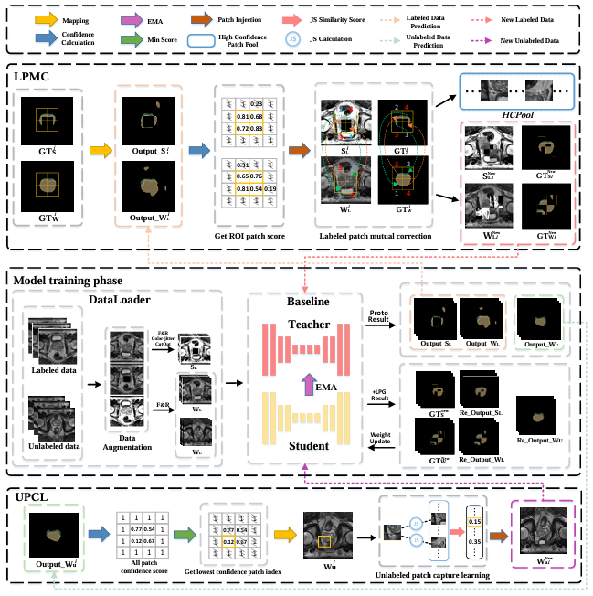

<div align="center">
  <h1>Semi-supervised Prostate Multi-Regional Semantic Segmentation with Patch-Based Plug-and-Play Correction Guidance</h1>
  <br>
  
</div>

## 1. Installation
```bash
git clone https://github.com/hai-medicallab/LPG.git
```
This repository is based on PyTorch 2.0.1, CUDA 12.4 and Python 3.10. All experiments in our paper were conducted on NVIDIA RTX A6000 GPU with an identical experimental setting.
```

pip install -r requirements.txt
```
## 2. Dataset
Data could be got at [Promise12](https://promise12.grand-challenge.org/),then run python script to preprocess the data.
<span style="color:red;">We will organize the HPH55 dataset and make it publicly available on the cloud after the paper is accepted.</span>
```
├── ./Promise12
    ├── [data]
        ├── case00.h5
        ├── ...
        └── [slices]
             ├── Case00_slice_0.h5
             ├── ...
    ├── test.list
    ├── train_slices.list
    ├── val.list
```

```

## 3. Usage

To train a model (Baeseline_name:SS-Net，BCP and DiffRect)

```bash
python ./Promise12_Baeseline_name_LPG_train.py  # for X training 
``` 

To test a model

```bash
python ./test_Promise12.py  # for X testing
```

## Acknowledgements
Our code is largely based on [SSNet](https://github.com/ycwu1997/SS-Net), [DiffRect](https://github.com/CUHK-AIM-Group/DiffRect), [BCP](https: //github.com/DeepMed-Lab-ECNU/BCP). Thanks for these authors for their valuable work, hope our work can also contribute to related research.

